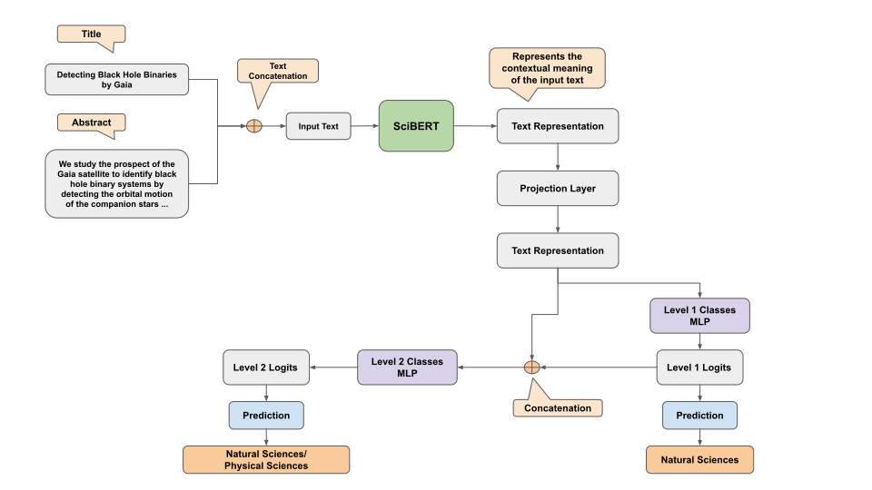

# Frascati-Classification-with-BERT
This is the code for a Frascati-Classifier using [SciBERT](https://github.com/allenai/scibert). A project for  ATHENA Research Center

Our task at hand is to classify publications based on the Frascati Classification Schema. 
So given a publication, we want a classifier to decide the Research Area, that this paper belongs, with the research area belonging of course to the Frascati Schema.

For example:

| DOI  | Title | Abstract | Research Area |
| - | --- | - | - |
| 10.1007/978-3-319-39577-7_14  | Dynamic Load Balancing Techniques for Distributed Complex Event Processing Systems  | International audience; Applying real-time, cost-effective Complex Event processing (CEP) in the cloud has been an important goal in recent years. Distributed Stream Processing Systems (DSPS) have been widely adopted by major computing companies such as Facebook and Twitter for performing scalable event processing in streaming data … | natural sciences/computer and information sciences  |

In the above example, our classifier predicted **natural sciences/computer and information sciences**. Notice that we have also predicted natural sciences and computer and information sciences. This is because the Frascati Classification schema has two levels. The first level consists of 6 high level research areas, listed below:

1. Engineering and Technology
2. Social Sciences
3. Agricultural Sciences
4. Natural Sciences
5. Humanities
6. Medical and Health Sciences

Each Level 1 class consists of some subclasses (Level 2 classes). In total the Level 2 classes are 42. We train our classifier to predict the Level 1 class and also the Level 2 class. However, in Level 2 we train on 36 classes, since the other 6 subclasses are not useful (they consist of subclasses such as: other social sciences, other humanities etc.)

# Data Acquisition
### EuroSciVoc
[European Science Vocabulary (EuroSciVoc)](https://op.europa.eu/en/web/eu-vocabularies/th-dataset/-/resource/dataset/euroscivoc) is the taxonomy of fields of science based on OECD's 2015 Frascati Manual taxonomy. It was extended with fields of science categories extracted from CORDIS content through a semi-automatic process developed with Natural Language Processing (NLP) techniques.

Based on the aforementioned definition, EuroSciVoc incorporates the Frascati Schema and takes it a step further, by extending it with more classes through NLP. The resulting taxonomy, namely EuroSciVoc, has a tree-like structure, which we can exploit.

The first two levels of EuroSciVoc are the Frascati Schema. In total EuroSciVoc consists of 8 levels. The most important observation here is, that since EuroSciVoc is a tree, each Level 3 class is also a Level 2 class and so on.

**As a result**, getting data for the Level 3 or Level 4 etc classes, means that we also get data for the Level 2 and Level 1 classes.
Ultimately we want as many data we can handle for the classes at Level 1 and Level 2.

### Microsoft Academic Graph
To get data, we utilized [Microsoft Academic Graph (MAG)](https://www.microsoft.com/en-us/research/project/microsoft-academic-graph/). For more information about the graph and how it is constructed, you can visit the link.

MAG also offers a taxonomy of topics and links each topic to several papers, where each paper is associated with some metadata (title, abstract etc). Our first step to get data from MAG, is to find how many common classes exist between EuroScivoc and MAG. We find common classes by searching with simple string matching and also searching by using Levenshtein distance.

Now, for each Frascati class (the first two levels of EuroSciVoc), we check if it exists in the common classes. If yes, we can simply get data for it. If no, we search in the common classes its children and so on. When we are done creating this mapping, we can simply parse MAG and get the data we need.

### Web of Science
For the classes that we were not able to find any data at all, we searched in [Web of Science (WOS)](https://apps.webofknowledge.com/WOS_GeneralSearch_input.do?product=WOS&search_mode=GeneralSearch&SID=C1jwYV7YvUfejTIvh5R&preferencesSaved=).

# Classifier Architecture
After the acquisition of data, we can train our classifier, whose architecture can be seen below:


# Installation and Files description

### Installation
As prerequisites, we only need a system with python3.6 and pip installed.

### Virtual Environment creation, Package Installation and Launching an API
The following steps will create a virtual environment, install the packages needed and start an API with a pretrained classifier.

- Clone or download the repository
- Untar the file in data/field_of_study_mag.rar (some .py files use its contents)
- Run **create_env_install_packages.sh**, which creates a virtual environment, activates it, installs all the packages in the **requirements.txt** and then deactivates the environment
- Run **run_api.sh**, which activates the previous created environment and executes **frascati_classifier_api.py**, which launches the API

### Downloading Microsoft Academic Graph, preprocessing it, extracting data and creating train,dev,test splits

- Run **download_and_parse_mag.sh**, which downloads a MAG dump, preprocesses it and then creates train,dev,test data

### Files Description

- **utils.py**: Contains all the utility functions, such as functions that parse the MAG dump, functions that split the data etc.
- **build_data.py**: Calls the functions from utils.py that parse the MAG dump and split the data.
- **frascati_classifier_api.py**: Launches the API implemented on Flask and given a publication's title and abstract, returns the Level 1 and Level 2 classes of the Frascati Schema that the classifier assigned.
- **frascati_classifier_infer.py**: It loads the pretrained Frascati classifier and contains infer functions. For example you can return the top-k most probable Frascati Classes. You can easily load another pretrained Frascati classifier by changing the checkpoint you load. 
- **train_bert_fos_subcats.py**: It trains and evaluates our Frascati classifier to the train and dev data.
- **requirements.txt**: It contains the python packages to install

# Calling the API
A curl example that calls the API
```
curl --header "Content-Type: application/json" --request POST --data '{"how_many": 3, "publications": [{"title": "Optimal areas and climate change effects on dragon fruit cultivation in Mesoamerica", "objective": "Climbing cacti with edible fruits have been proposed as new dryland fruit crops because their high water-use efficiency reduces water requirement. One lineage of climbers in the cactus family, the Hylocereus group of Selenicereus, includes several species that produce edible fruits and is currently cultivated around the world. Fruits are known as pitahayas, pitayas or dragon fruit. Here, by means of ecological niche-based modelling and analytical hierarchical modelling, the optimal areas for cultivating the three main species of this group in Mesoamerica – Selenicereus costaricensis, Selenicereus ocamponis and Selenicereus undatus – are identified. Data on distribution, physiological requirement and host preferences are taken into account to carry out ecological modelling for current and future scenarios of climate and determine its impact on cultivation. Two MIROC climatic future models, one optimistic (ssp216) and a pessimistic (ssp585) were selected and 554 records from Mexico and Central America were gathered. For all three species, temperature and precipitation seasonality, and solar radiation were the most significant variables in the niche modelling. In addition, for S. undatus the most important hosts, three species of mesquite legume trees were significant to forecast suitable areas for planting. Large areas on the Pacific side from Sinaloa to Costa Rica were predicted as favourable for cultivating the studied three species. Future scenarios of climate change predicted increase of suitable areas for two species and in particular for S. undatus the increment was the largest. Therefore, dragon fruits are corroborated as promising fruits in view of climate change."}]}' some_ip:29925/scibert_fos_api 
```
